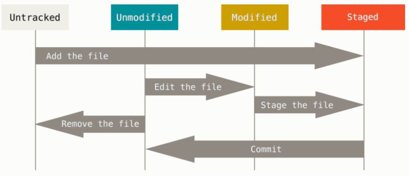

## GIT - Everything is Local Topics

##### Features of GIT
    1. Distributed
    2. Everything is Local
    3. 

##### Whats on your local Repo?
   1. Every local repo and their files in your PC, goes through 4 stages as shown below.
    
   2. git clone "repo" = all files are at unmodified state.
   3. git init = all files are at unmodified and untracked state.
   4. edit file1.file = it becomes Modified.
   5. git add file1.file = move the same to Staged.
   6. touch newfile.file = By default in Untracked state.
   7. git add newfile.file = the file goes to Staged state.
   
>On your local Repo, you will find a .git folder. Thats your local git repo where all your staged changes are to be committed.

>The reason we say GIT is distributed, is you have your own repo maintenance with complete revision history on your local machine.

>The commits you do to your repo (usually with git commit after git add or together as git commit -am "message") gets stored in the .git folder that you see on your repo.

>Basicaly these commits are queued in your repo for you to push all these from the queue to the main repo on the network.

>Unlike SVN, where even for checking log, you need a network connection to the svn server, thats because all the revision history is stored on the server.
You do a diff, you need a data from server.

>For GIT, the .git folder stores all your revision history along with the source data from the repo you have cloned. Thus effectively able to get logs and do diff from a local repo.

>On the Flow => You change a File => it goes to Modified stage => You run git add => It goes to stage => You run git commit => You commit to your local repo => You run git push => you push the local repo committed changes to the central repo

#### Some hint points
1. git branch name = creates a new branch
2. git checkout name = switches working directory to the newly created branch
3. git checkout master = switches working directory to the master branch
4. git status = shows the status of your pending commits, stages and a HEAD pointer to the current branch name
5. git log --decorate = a decorated view of the log history of your commits between your local branches
6. git merge
    1. **Merge** - A merge between branches where there is no clear back path defined. This means that when we backtrace from a branch to merge to a branch from merge the path contains other merges and commits. Some time this would result in conflicts which will require the author to verify, change and commit manually.
    2. **Fast Forward** - A simple merge between branches where there is a clear back path defined. This means that there are no merges or commits between the branches getting merged. Hence its just a factor of merging the new changes and moving the HEAD pointer.
    3. **Re-Base** - This is when developer A is working on a branch, and developer B is working on another. Developer A commits and does the fast forward merge to parent/master. Now developer B can rebase his local branch, this means to keep aside temporarily his local changes and pull all recent changes from master/parent. Once done, his changes can me staged, committed and pushed again. Once this is done he can go to the parent/master and do a re-base. This makes sure all the conflicts are resolved at his branch level and enables him to merge a clean code to the parent/master.
7. Will be updating the wiki for more information.................  

    
##### All below resources are from the web.
  1. [Installing GIT](https://git-scm.com/book/en/v2/Getting-Started-Installing-Git, "Installing GIT")
  2. [Getting a GIT Repo on your machine](https://git-scm.com/book/en/v2/Git-Basics-Getting-a-Git-Repository, "Getting a GIT Repo")
  3. [Changes to the Repo](https://git-scm.com/book/en/v2/Git-Basics-Recording-Changes-to-the-Repository, "Changes to the Repo")
  4. Will be updating the wiki for more information.................
  