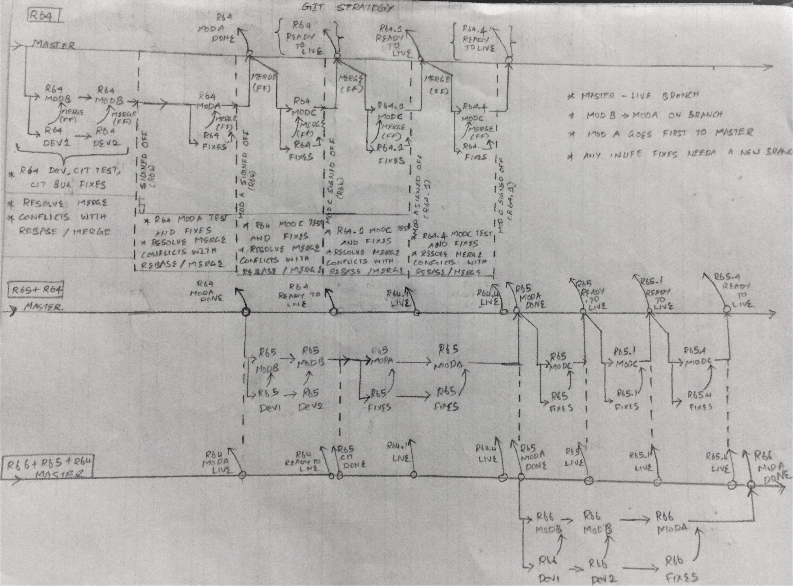

## SVN to GIT Ideas
### The following guide helps with your migration. 
  1. Usual SVN Branching Strategy
  2. SVN to GIT Branching Strategy
  3. Steps to convert your trunk, branches and tags from SVN to GIT
  4. Pushing your migrated repo to your GIT.
  

### 1. Usual SVN Branching Strategy
#### SVN Branching Strategy
  - SVN has a three folder global structure for your code base and your contents.
  - **TRUNK**
    - Developers and content owners use trunk mostly for current development. Trunk is usually lifeline development branch.
  - **BRANCH**
     - Developers move the code from trunk to branch when a its ready for testing, especially the development testing is complete. Once a code is moved from Trunk to Branch , the Branch becomes the go-live branch for the current development. All further testing happens from the release of this branch.
   - **TAGS**
     - Whenever a branch is release,the same will be tagged for future reference to the TAGS folder. Even from TRUNK tags can be obtained at any state. Content moved to tag usually stays there as a marked revision for ready to use. Usually none of the active development happens at the TAGS folder.
     
 ### SVN Release TimeLine
  - Release N - Current Development Version
  - Release N-1 - Release currently in Live and support branches.
  - Release N+1 - Upcoming Release for Development.
  
  

### 2. SVN to GIT Branching Strategy

#### Before Getting into SVN to GIT Branching Strategy , you would wish to learn more about GIT and ways to use it.
 > You can go through [this page](./GIT.md) for a list of topics on learning more about GIT. If you are new to GIT, it would be better you go through these links before jumping to branching strategy below.
 
#### Heading to Branching Strategy

  - Please refer [GIT Branches Guide](https://git-scm.com/book/en/v2/Git-Branching-Branches-in-a-Nutshell) for detailed information on how branching works with git.
  - Please refer [GIT Basic Branching Guideline](https://git-scm.com/book/en/v2/Git-Branching-Basic-Branching-and-Merging) for a Basic Branching strategy guideline.
  - Please refer to [GIT Branch, Merge Video by David Mahler](https://youtu.be/FyAAIHHClqI)
  
  1. From above links you must have understood that git uses master branch as the lifeline branch where merges happen often before the feature release 
  goes to live.
  2. All other branches are feature, bug fixes, new requirement branches which are used by developers and content writers for 
  their work. All the development test happens on these branches and before pushing to live they are always
  merged to the lifeline master branch.
  3. At any point of time the version on live/production is always from the master branch.
  4. You can create markers or tags from the master branch which have gone to live before for a historical
  revision data.
  5. The below diagram would explain the same,
        1. Release N - Current Development Version
        2. Release N+1 - Next development Version.
        3. Release N+2 - One past next development Version.
 
   

 ### 3. Steps to convert your trunk, branches and tags from SVN to GIT
  - We will be using git svn clone tool to perform the below operations.
  - Prerequisites
    1. Make sure all your svn folders are cleaned to remove unnecessary folders from migrating to git.
    2. GIT doesnt have a separate tag folder or branch tree like SVN. Although you can migrate all of your tags as your branches in GIT, if you are not concerned about the revision history of these 
    tags folder then you can clean and move necessary trunk items to the branch.
    3. Once you have moved the needed tags to branches, then you can clean the tags folder.
    4. Make sure trunk and branches are cleaned.
    5. If you do not wish to maintain all the history releases, you can delete and maintain based on a agreed retention period, lets say
    we maintain branches for the past 5 releases.
  - Given below are the steps **We need to edit below for including branches**
      1.  Use SVN Log to get all author information to a text file - authors.txt
            >1. svn log -q "svnbaseurl" | awk -F '|' '/^r/ {sub("^ ", "", $2); sub(" $", "", $2); print $2" = "$2" <"$2">"}' | sort -u > authors.txt
      2. Get SVN Revision history starting number for your svn base url
            >2. svn log --stop-on-copy "svnbaseurl"
      3. From above command output take the last number of revision, that is the base revision from where you need to migrate.
      4. Once marked, run below command to migrate the entire svn with revision history to your local Repo.
            >3. nohup echo "password" | git svn clone -r"revisionnumber":HEAD --username "username" --no-minimize-url --no-metadata --authors-file authors.txt "svnbaseurl"  > out.txt 2>&1
   - The above steps would take time based on the size of your SVN repository.
   - It is advised to run above steps as a background process since it takes time. UNIX or WINDOWS is your choice.
   - The above commands are presented in UNIX format.
   
   
