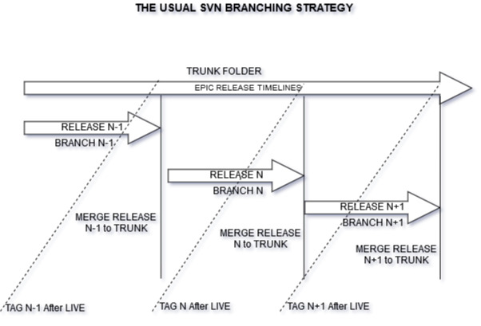

## SVN to GIT Ideas
### The following guide helps with two topics. 
  1. Usual SVN Branching Strategy
  2. SVN to GIT Branching Strategy
  3. Steps to convert your trunk, branches and tags from SVN to GIT

### 1. Usual SVN Branching Strategy
#### SVN Branching Strategy
  - SVN has a three folder global structure for your code base and your contents.
  - **TRUNK**
    - Developers and content owners use trunk mostly for current development. Trunk is usually lifeline development branch.
  - **BRANCH**
     - Developers move the code from trunk to branch when a its ready for testing, especially the development testing is complete. Once a code is moved from Trunk to Branch , the Branch becomes the go-live branch for the current development. All further testing happens from the release of this branch.
   - **TAGS**
     - Whenever a branch is release,the same will be tagged for future reference to the TAGS folder. Even from TRUNK tags can be obtained at any state. Content moved to tag usually stays there as a marked revision for ready to use. Usually none of the active development happens at the TAGS folder.
     
 ### SVN Release TimeLine
  - Release N - Current Development Version
  - Release N-1 - Release currently in Live and support branches.
  - Release N+1 - Upcoming Release for Development.
  
  
  
    

### 2. SVN to GIT Branching Strategy
  - Please refer [GIT Branches Guide](https://git-scm.com/book/en/v2/Git-Branching-Branches-in-a-Nutshell) for detailed information on how branching works with git.
  - Please refer [GIT Basic Branching Guideline](https://git-scm.com/book/en/v2/Git-Branching-Basic-Branching-and-Merging) for a Basic Branching strategy guideline.
  
  1. From above links you must have understood that git uses master branch as the lifeline branch where merges happen often before the feature release 
  goes to live.
  2. All other branches are feature, bug fixes, new requirement branches which are used by developers and content writers for 
  their work. All the development test happens on these branches and before pushing to live they are always
  merged to the lifeline master branch.
  3. At any point of time the version on live/production is always from the master branch.
  4. You can create markers or tags from the master branch which have gone to live before for a historical
  revision data.
  5. The below diagram would explain the same,
        1. Release N - Current Development Version
        2. Release N-1 - Release currently in LIVE and support branches.
        3. Release N+1 - Upcoming Release for Development.
 

 

### 3. Steps to convert your trunk, branches and tags from SVN to GIT
  - we will be using git svn clone tool to perform the below operations.
  - you can read the second topic on branching strategy when you wish to decide 
